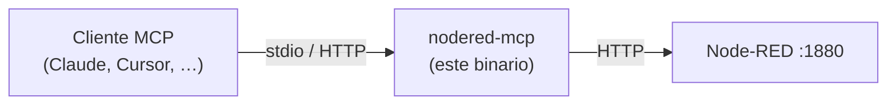

# nodered-mcp

Un servidor [MCP (Model Context Protocol)](https://modelcontextprotocol.io)
escrito en Go que expone la admin API de Node-RED a clientes de IA
como tools, resources y prompts.



`nodered-mcp` es independiente del proveedor. El mismo binario
funciona con cualquier cliente compatible con MCP — Claude Desktop,
Claude Code, Cursor, VS Code, Gemini CLI, OpenCode, Pi, Cline — sea
cual sea el modelo subyacente.

La versión en inglés de este documento está en
[`README.md`](./README.md).

## Instalación

Tres canales soportados. Elige el que mejor te encaje:

```bash
# npm — funciona en todas las plataformas. Recomendado.
npm install -g @fgjcarlos/nodered-mcp
```

```bash
# go install — para quien tenga toolchain de Go.
go install github.com/fgjcarlos/nodered-mcp/cmd/nodered-mcp@latest
```

```bash
# Docker — descarga la imagen y sigue el ejemplo completo de arranque de abajo.
docker pull ghcr.io/fgjcarlos/nodered-mcp:latest
```

Tras instalar, genera el snippet para tu cliente MCP:

```bash
# 2. Generar el snippet para tu cliente MCP
nodered-mcp init --write

# 3. Reinicia tu cliente MCP; aparecen 44 tools bajo el servidor "nodered"
```

¿Problemas? Consulta [`docs/troubleshooting.md`](./docs/troubleshooting.md).

## Docker

La imagen sirve HTTP streamable en el puerto `8090`. No contiene un token
MCP ni una URL de Node-RED: un token no se puede incluir de forma segura en
una imagen y `host.docker.internal` no está disponible en todas las
plataformas Docker.

Define un token en tu shell y arranca el contenedor con una URL de Node-RED
explícita y un puerto publicado solo en loopback:

```bash
export MCP_HTTP_TOKEN="$(openssl rand -hex 32)"

docker run --rm --name nodered-mcp \
  --publish 127.0.0.1:8090:8090 \
  --env MCP_HTTP_TOKEN \
  --env NODERED_URL=http://host.docker.internal:1880 \
  ghcr.io/fgjcarlos/nodered-mcp:latest
```

En Docker Desktop (macOS o Windows), `host.docker.internal` llega a una
instancia de Node-RED que se ejecuta en el host. Envía las solicitudes MCP a
`http://127.0.0.1:8090/mcp` con `Authorization: Bearer $MCP_HTTP_TOKEN`.
El token es obligatorio incluso con un puerto publicado solo en loopback
porque el listener del contenedor se enlaza a todas sus interfaces.

En Docker Engine para Linux, añade el mapeo host-gateway de Docker antes de
usar ese hostname:

```bash
docker run --rm --name nodered-mcp \
  --add-host host.docker.internal:host-gateway \
  --publish 127.0.0.1:8090:8090 \
  --env MCP_HTTP_TOKEN \
  --env NODERED_URL=http://host.docker.internal:1880 \
  ghcr.io/fgjcarlos/nodered-mcp:latest
```

Si Node-RED es otro contenedor, usa una red Docker compartida y el nombre de
su servicio o contenedor; funciona tanto en Docker Desktop como en Linux:

```bash
docker network create nodered-mcp
docker network connect nodered-mcp node-red

docker run --rm --name nodered-mcp \
  --network nodered-mcp \
  --publish 127.0.0.1:8090:8090 \
  --env MCP_HTTP_TOKEN \
  --env NODERED_URL=http://node-red:1880 \
  ghcr.io/fgjcarlos/nodered-mcp:latest
```

Sustituye `node-red` por el nombre real del contenedor o servicio de Compose.
No publiques el puerto `8090` más allá de loopback salvo que el firewall del
host y la autenticación del transporte estén configurados para esa exposición.

## Documentación

La referencia completa está en [`docs/`](./docs/):

| Doc | Cubre |
|---|---|
| [`docs/architecture.md`](./docs/architecture.md) | Árbol de fuentes, dependencias, modelo JSON-opaco, backup antes de escribir |
| [`docs/tools.md`](./docs/tools.md) | Catálogo de las 44 tools MCP (read / write / action) |
| [`docs/configuration.md`](./docs/configuration.md) | Variables de entorno y flags de línea de comandos |
| [`docs/transports.md`](./docs/transports.md) | Transportes stdio y streamable HTTP, bearer auth, OAuth 2.1 |
| [`docs/clients.md`](./docs/clients.md) | Snippets de configuración por cliente MCP |
| [`docs/troubleshooting.md`](./docs/troubleshooting.md) | Modos de fallo habituales y cómo recuperarse |
| [`docs/roadmap.md`](./docs/roadmap.md) | Trabajo abierto, riesgos aceptados, versiones planeadas |

## Seguridad

Dar acceso de escritura a un LLM sobre un runtime de automatización
en marcha exige guardarraíles. Hay tres integrados:

- Los documentos de flow se tratan como JSON opaco — sin structs
  fijos de Go, sin pérdida de campos.
- Cada operación mutante hace un snapshot completo de la
  configuración antes y falla en cerrado si no puede escribirlo.
- Los wires se validan antes de que la escritura llegue al runtime;
  los destinos colgantes se rechazan en la capa MCP.

Arranca con `--read-only` (o `MCP_READ_ONLY=true`) para anunciar
solo las 21 tools de lectura y esconder todas las mutantes en el
registro. `inject_node` también se esconde: disparar un inject puede
mandar una orden real a un dispositivo real.

Modelo de amenaza completo y checklist de hardening:
[`SECURITY.md`](./SECURITY.md).

## Desarrollo

```bash
go test ./...
go build -o nodered-mcp ./cmd/nodered-mcp
```

Las tareas viven como GitHub Issues. Las decisiones de diseño y
auditorías históricas están bajo [`docs/`](./docs/). Consulta
[`CONTRIBUTING.md`](./CONTRIBUTING.md) para el flujo de trabajo.

## Licencia

MIT. Ver [`LICENSE`](./LICENSE).
