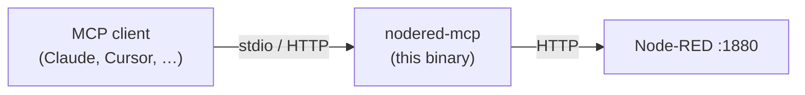

# nodered-mcp

An [MCP (Model Context Protocol)](https://modelcontextprotocol.io)
server, written in Go, that exposes the Node-RED admin API to AI
clients as tools, resources, and prompts.



`nodered-mcp` is provider-agnostic. The same binary works with any
MCP-capable client — Claude Desktop, Claude Code, Cursor, VS Code,
Gemini CLI, OpenCode, Pi, Cline — regardless of the underlying
model.

A Spanish version of this document is available at
[`README.es.md`](./README.es.md).

## Quickstart

```bash
# 1. Install
npm install -g @fgjcarlos/nodered-mcp

# 2. Generate the snippet for your MCP client
nodered-mcp init --write

# 3. Restart your MCP client; 43 tools appear under the "nodered" server
```

Need help? See [`docs/troubleshooting.md`](./docs/troubleshooting.md).

## Documentation

The full reference lives in [`docs/`](./docs/):

| Doc | Covers |
|---|---|
| [`docs/architecture.md`](./docs/architecture.md) | Source tree, dependencies, JSON-opaque flow model, backup-before-write guardrail |
| [`docs/tools.md`](./docs/tools.md) | Catalog of the 43 MCP tools (read / write / action) |
| [`docs/configuration.md`](./docs/configuration.md) | Environment variables and command-line flags |
| [`docs/transports.md`](./docs/transports.md) | stdio and streamable HTTP transports, bearer auth, OAuth 2.1 |
| [`docs/clients.md`](./docs/clients.md) | Per-MCP-client configuration snippets |
| [`docs/troubleshooting.md`](./docs/troubleshooting.md) | Common failure modes and how to recover |
| [`docs/roadmap.md`](./docs/roadmap.md) | Open work, accepted risks, planned versions |

## Safety

Handing an LLM write access to a running automation runtime demands
guardrails. Three are built in:

- Flow documents are treated as opaque JSON — no fixed Go structs,
  no field loss.
- Every mutating operation takes a backup of the full flow
  configuration first and fails closed if the snapshot cannot be
  written.
- Wires are validated before the write reaches the runtime; dangling
  wire targets are rejected at the MCP layer.

Run with `--read-only` (or `MCP_READ_ONLY=true`) to advertise only
the 20 read tools and withhold every mutating one at registration.
`inject_node` is also withheld: firing an inject can send a real
command to real hardware.

Full threat model and hardening checklist:
[`SECURITY.md`](./SECURITY.md).

## Development

```bash
go test ./...
go build -o nodered-mcp ./cmd/nodered-mcp
```

Work items live as GitHub Issues. Design decisions and historical
audit reports live under [`docs/`](./docs/). See
[`CONTRIBUTING.md`](./CONTRIBUTING.md) for the workflow.

## License

MIT. See [`LICENSE`](./LICENSE).

## Related project

[`nrcc`](https://github.com/fgjcarlos/nrcc) — Node-RED Control
Center, a Go and React web dashboard for administering Node-RED
instances. A separate codebase with no shared code, designed to
coexist with this server.