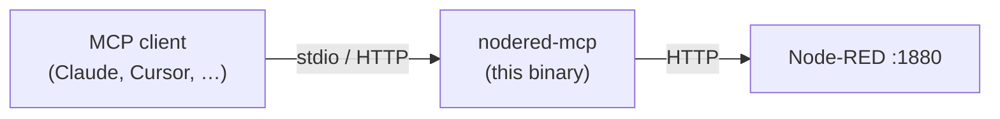

# nodered-mcp

An [MCP (Model Context Protocol)](https://modelcontextprotocol.io)
server, written in Go, that exposes the Node-RED admin API to AI
clients as tools, resources, and prompts.



`nodered-mcp` is provider-agnostic. The same binary works with any
MCP-capable client — Claude Desktop, Claude Code, Cursor, VS Code,
Gemini CLI, OpenCode, Pi, Cline — regardless of the underlying
model.

A Spanish version of this document is available at
[`README.es.md`](./README.es.md).

## Install

Three channels are supported. Pick the one that fits:

```bash
# npm — works on every platform. Recommended.
npm install -g @fgjcarlos/nodered-mcp
```

```bash
# go install — for anyone with a Go toolchain.
go install github.com/fgjcarlos/nodered-mcp/cmd/nodered-mcp@latest
```

```bash
# Docker — pull the image, then follow the complete startup example below.
docker pull ghcr.io/fgjcarlos/nodered-mcp:latest
```

The npm channel runs a checksum-verified, atomic postinstall. The
tarball is downloaded from the matching GitHub release, its SHA-256
is verified against the release's `checksums.txt`, the archive is
extracted into a per-run staging directory under `os.tmpdir()`, and
the binary is moved into place via a temp file + atomic rename. On
any failure — bad checksum, download timeout, corrupted archive, or
promotion error — the staging directory is removed and `bin/` is
left untouched, so a partial install never overwrites a working
prior one. The wrapper writes a `.installed` marker only after the
binary is in place; subsequent `npm install` calls skip the
download when the marker version matches. Re-installs fire
automatically when the marker is missing or stale (corrupt prior
install, version upgrade).

After install, generate the snippet for your MCP client:

```bash
# 2. Generate the snippet for your MCP client
nodered-mcp init --write

# 3. Restart your MCP client; 44 tools appear under the "nodered" server
```

For first-time bootstrap or recovery, `setup` creates a default config
directory and writes a managed `.env.example` you can edit; `doctor`
re-verifies the last successful setup and reports drift. Both commands
are idempotent and write a receipt under `$XDG_STATE_HOME/nodered-mcp/receipts/`:

```bash
# One-shot bootstrap. Safe to re-run; a second invocation is a no-op
# unless the managed state has drifted.
nodered-mcp setup

# Read-only check: re-verifies the last setup receipt and exits 2 on drift.
nodered-mcp doctor

# Force a re-apply when the receipt says everything is fine but you want
# the latest managed `.env.example` shape.
nodered-mcp setup --force
```

Need help? See [`docs/troubleshooting.md`](./docs/troubleshooting.md).

## Docker

The image serves streamable HTTP on port `8090`. It does not contain an
MCP token or a Node-RED URL: a token cannot be safely baked into an image,
and `host.docker.internal` is not available on every Docker platform.

Set a token in your shell, then start the container with an explicit
Node-RED URL and a loopback-only published port:

```bash
export MCP_HTTP_TOKEN="$(openssl rand -hex 32)"

docker run --rm --name nodered-mcp \
  --publish 127.0.0.1:8090:8090 \
  --env MCP_HTTP_TOKEN \
  --env NODERED_URL=http://host.docker.internal:1880 \
  ghcr.io/fgjcarlos/nodered-mcp:latest
```

On Docker Desktop (macOS or Windows), `host.docker.internal` reaches a
Node-RED instance running on the host. Send MCP requests to
`http://127.0.0.1:8090/mcp` with `Authorization: Bearer $MCP_HTTP_TOKEN`.
The token is required even with a loopback-only published port because the
container listener binds all of the container's interfaces.

On Docker Engine for Linux, add Docker's host-gateway mapping before using
that hostname:

```bash
docker run --rm --name nodered-mcp \
  --add-host host.docker.internal:host-gateway \
  --publish 127.0.0.1:8090:8090 \
  --env MCP_HTTP_TOKEN \
  --env NODERED_URL=http://host.docker.internal:1880 \
  ghcr.io/fgjcarlos/nodered-mcp:latest
```

If Node-RED is another container, use a shared Docker network and its
service or container name instead; this works on Docker Desktop and Linux:

```bash
docker network create nodered-mcp
docker network connect nodered-mcp node-red

docker run --rm --name nodered-mcp \
  --network nodered-mcp \
  --publish 127.0.0.1:8090:8090 \
  --env MCP_HTTP_TOKEN \
  --env NODERED_URL=http://node-red:1880 \
  ghcr.io/fgjcarlos/nodered-mcp:latest
```

Replace `node-red` with the actual container or Compose service name. Do not
publish port `8090` beyond loopback unless the host firewall and transport
authentication are configured for that exposure.

## Documentation

The full reference lives in [`docs/`](./docs/):

| Doc | Covers |
|---|---|
| [`docs/architecture.md`](./docs/architecture.md) | Source tree, dependencies, JSON-opaque flow model, backup-before-write guardrail |
| [`docs/tools.md`](./docs/tools.md) | Catalog of the 44 MCP tools (read / write / action) |
| [`docs/configuration.md`](./docs/configuration.md) | Environment variables and command-line flags |
| [`docs/transports.md`](./docs/transports.md) | stdio and streamable HTTP transports, bearer auth, OAuth 2.1 |
| [`docs/clients.md`](./docs/clients.md) | Per-MCP-client configuration snippets |
| [`docs/troubleshooting.md`](./docs/troubleshooting.md) | Common failure modes and how to recover |
| [`docs/roadmap.md`](./docs/roadmap.md) | Open work, accepted risks, planned versions |

## Safety

Handing an LLM write access to a running automation runtime demands
guardrails. Three are built in:

- Flow documents are treated as opaque JSON — no fixed Go structs,
  no field loss.
- Every mutating operation takes a backup of the full flow
  configuration first and fails closed if the snapshot cannot be
  written.
- Wires are validated before the write reaches the runtime; dangling
  wire targets are rejected at the MCP layer.

Run with `--read-only` (or `MCP_READ_ONLY=true`) to advertise only
the 21 read tools and withhold every mutating one at registration.
`inject_node` is also withheld: firing an inject can send a real
command to real hardware.

Full threat model and hardening checklist:
[`SECURITY.md`](./SECURITY.md).

## Development

```bash
go test ./...
go build -o nodered-mcp ./cmd/nodered-mcp
```

Work items live as GitHub Issues. Design decisions and historical
audit reports live under [`docs/`](./docs/). See
[`CONTRIBUTING.md`](./CONTRIBUTING.md) for the workflow.

## License

MIT. See [`LICENSE`](./LICENSE).
