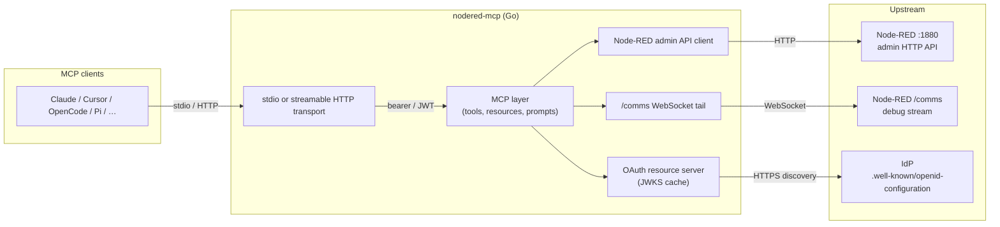
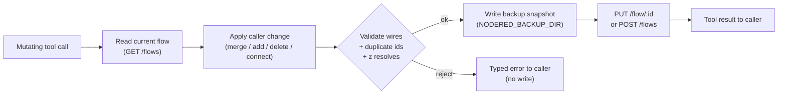

# Architecture

`nodered-mcp` is a single binary that translates MCP requests into
Node-RED admin API calls. The MCP layer is deliberately thin: each
client method maps to exactly one admin endpoint; the MCP layer
decides how to expose those operations as tools.

## Data flow

The end-to-end shape, including the OAuth discovery path that the
ASCII version lost in indentation:



## Edit pipeline

Mutating tools follow a read-modify-write path with three guards
before any byte reaches the runtime. Optional diagram for
operators debugging a flow write that was rejected:



## Source tree

```
nodered-mcp/
├── cmd/nodered-mcp/
│   ├── main.go         # entrypoint; subcommands serve / init / version
│   ├── init.go         # client detection and MCP config writer
│   └── update.go       # in-place upgrade detection
├── internal/
│   ├── config/
│   │   ├── config.go       # env-var + flag loader
│   │   └── httpauth.go     # bearer + OAuth wiring
│   ├── nodered/
│   │   ├── client.go       # HTTP client + auth
│   │   ├── flows.go        # flow CRUD (JSON-opaque)
│   │   ├── edit.go         # granular node editing
│   │   ├── inspect.go      # flow summary and search
│   │   ├── diff.go         # configuration comparison
│   │   ├── nodes.go        # palette: install / uninstall / enable / disable
│   │   ├── settings.go     # settings, runtime state, npm search
│   │   ├── runtime.go      # diagnostics, context, plugins
│   │   ├── comms.go        # /comms WebSocket tail
│   │   ├── backup.go       # snapshot before write
│   │   ├── status.go       # node-status cache from /comms
│   │   ├── logs.go         # /logs client
│   │   ├── subflows.go     # subflow CRUD
│   │   ├── validate.go     # local structural validation
│   │   └── types.go        # minimal types + RawFlow
│   ├── mcp/
│   │   ├── server.go       # stdio + streamable HTTP transports
│   │   ├── tools.go        # tool registration table
│   │   ├── tools_flows.go  # flow-handler implementations
│   │   ├── tools_nodes.go  # palette handlers
│   │   ├── tools_subflows.go
│   │   ├── tools_context.go
│   │   ├── tools_runtime.go
│   │   ├── tools_settings.go
│   │   ├── tools_backups.go
│   │   ├── tools_shared.go
│   │   ├── resources.go    # 3 resources
│   │   ├── prompts.go      # 2 prompts
│   │   ├── httpauth.go     # bearer + OAuth middleware
│   │   ├── http_observe.go
│   │   ├── http_ratelimit.go
│   │   └── clipboard.go
│   └── oauth/
│       ├── discovery.go    # /.well-known/openid-configuration
│       ├── jwks.go         # JWKS cache + verification
│       ├── verifier.go     # token verification
│       └── middleware.go   # authorization middleware
└── examples/
    ├── claude_desktop_config.json
    ├── cursor_mcp.json
    ├── gemini_settings.json
    ├── vscode_mcp.json
    ├── opencode_config.json
    └── pi_mcp_config.json
```

You can regenerate this tree with:

```bash
find cmd internal -name '*.go' ! -name '*_test.go' | sort
```

Any `.go` not listed here is drift; any path listed here that does
not exist on disk is also drift.

## Dependencies

| Component | Choice |
|---|---|
| Language | Go 1.25+ |
| MCP SDK | [`mark3labs/mcp-go`](https://github.com/mark3labs/mcp-go) — stdio and streamable HTTP |
| HTTP client | `net/http` (standard library) |
| WebSocket | [`coder/websocket`](https://github.com/coder/websocket) — the `/comms` debug stream, no transitive dependencies |
| JWT | [`golang-jwt/jwt/v5`](https://github.com/golang-jwt/jwt) — OAuth token verification |
| Logging | `log/slog` (standard library) |
| Dev config | [`godotenv`](https://github.com/joho/godotenv) |

No frameworks, no ORM, no third-party Node-RED client.

## Design decision: flows are JSON-opaque

`RawFlow` is typed as `json.RawMessage`:

```go
// internal/nodered/types.go
type RawFlow = json.RawMessage
```

Node-RED is deliberately schemaless — each node type has its own
shape. Modelling nodes with fixed Go structs would silently drop
every unrecognised field on a read/write round-trip. `nodered-mcp`
passes flow JSON through verbatim and parses only the specific
fields it needs, where it needs them. No field is ever lost.

**Rules:**

- Flows and nodes are handled as **JSON-opaque**. Zero field loss.
- Only the specific fields needed at the call site are parsed
  (e.g. extracting `id` / `type` / `label` for a readable summary).
- The server never rewrites a node it does not understand — it
  passes it through verbatim.
- Watch out for what an LLM edits blindly: `wires`
  (`[[out1, out2], …]`), IDs, shared config nodes, and credentials
  (separate channel).
- **Finding that cost time:** `GET /flow/:id` **does not** return a
  single array. It splits the tab's contents into `nodes` and
  `configs`, with the rule in `runtime/lib/flows/util.js`: an object
  with `x`/`y` canvas coordinates goes to `nodes`, anything else to
  `configs`. A shared MQTT broker lives in `configs` even though it
  belongs to the tab. The granular editing tools honour that split;
  ignoring it made nodes disappear from the canvas.
- **Reading trap for new contributors:** `grep Extra internal/nodered/`
  hits `internal/nodered/edit.go`. **That is not the v0.1 bug.**
  The original bug was a struct field with a `json:"-"` tag that
  `encoding/json` discards entirely. The current
  `Extra map[string]json.RawMessage` exists precisely to preserve
  unknown tab fields across the round-trip. The field's presence is
  the cure, not the disease.
- **Editing strategy:** both, with the granular ones by default
  (`add_node`, `update_node`, `delete_node`, `connect_nodes`) and
  `update_flow` as the escape hatch for full rewrites. `update_node`
  **merges** properties instead of replacing; `delete_node` cleans
  up incoming wires; `connect_nodes` appends to the named port and
  grows the wires array when that port does not exist yet.

## Safety: backup before every write (v0.1 guardrail)

Every mutating operation (`POST /flows`, `PUT /flow/:id`,
`DELETE /flow/:id`) takes, **before** touching anything, a
`GET /flows` (the complete `flows.json`) and writes it to disk with
a timestamp.

- Directory: env `NODERED_BACKUP_DIR` (default `./backups` or OS temp).
- Filename: `flows-<RFC3339>.json`.
- A snapshot of the full config covers any write ("at least
  `flows.json`").
- Enables rollback via `list_backups` / `restore_backup` tools.
- Node-RED has its own one-level `.backup`, but it is local to the
  host and the MCP speaks over HTTP — it does not help here.
- Backup filenames are restricted to bare names: `restore_backup`
  cannot be used to read arbitrary files from disk.

<!-- ponytail: no backup pruning; add prune (keep last N) when the dir gets unwieldy -->

## Verifying the claims

```bash
# Tool counts (source of truth lives in internal/mcp/tools_test.go)
grep -oE 'mcp\.NewTool\("[a-z_]+"' internal/mcp/tools.go | sed 's/.*"//;s/"//' | sort -u
grep -c 'addReadTool('  internal/mcp/tools.go     # -> 20
grep -c 'addWriteTool(' internal/mcp/tools.go     # -> 23

# Source tree
find cmd internal -name '*.go' ! -name '*_test.go' | sort

# Environment variables
grep -ohE '"(NODERED|MCP)_[A-Z_]+"' internal/config/*.go | sort -u
```

## Findings that cost time

Noted here because they are not obvious from the code and will bite
again if ignored:

- **`GET /flow/:id` does not return a single array.** It splits
  contents into `nodes` and `configs` based on whether the object
  carries `x`/`y` coordinates (`runtime/lib/flows/util.js`). A shared
  broker belongs to the tab but appears in `configs`.
- **`go install …@latest` already works without a tag**, resolving
  to a pseudo-version. `resolveVersion` recovers the real version
  from build info.
- **`gofmt -l` flags every file on Windows** because of CRLF in the
  working tree. The repo stores LF and the CI gate passes. No need
  for `.gitattributes` changes.
- **`go test -race` fails locally** because of a broken TDM-GCC,
  not because of the code. That is why CI runs `-race` only on
  Linux.
- **`:8090` is not loopback.** It listens on every interface. That
  is why the token is mandatory there.
- **Setting `MCP_HTTP_TOKEN` and `MCP_OAUTH_ISSUER` together** is a
  configuration error and the server refuses to start. It is not a
  runtime check — it is validated at boot.